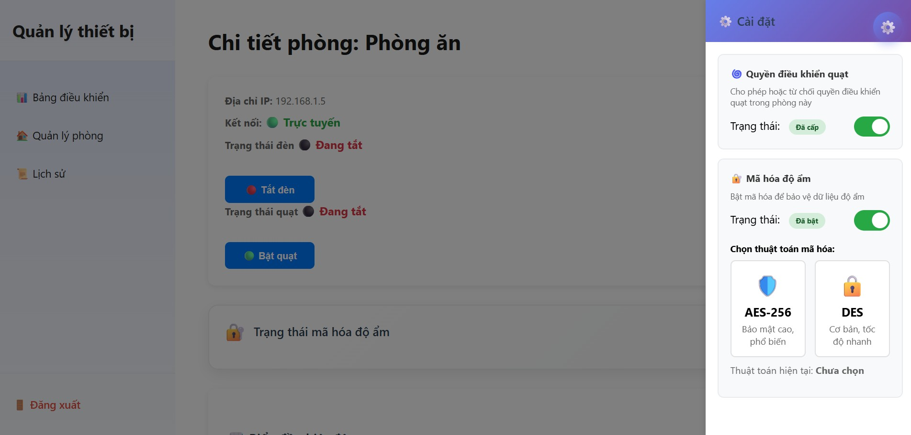
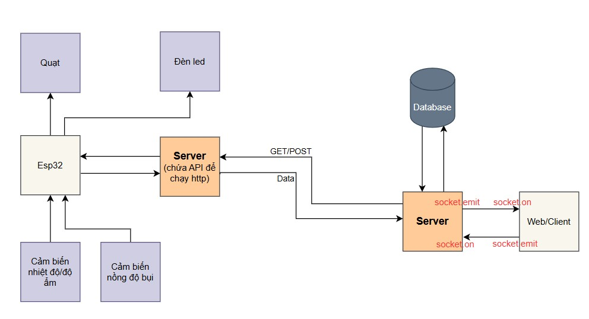

# 🚀 Dự án quản lý thiết bị trong nhà — Mô tả dự án

Dự án này gồm:
- ESP32 thu thập dữ liệu (nhiệt độ, độ ẩm, sau đó thực hiện điều khiển đèn, quạt từ giao diện) sau đó mã hóa AES-256 hoặc DES
- Server Node.js nhận dữ liệu từ ESP32 qua HTTP, thực hiện giải mã
- Dashboard Web hiển thị trạng thái các phòng và tính năng điều khiển thiết bị
---

## 📸 Demo
### 1️⃣ Giao diện chi tiết trong 1 phòng
Hiển thị trạng thái phòng, thiết bị online/offline, số liệu cảm biến cập nhật theo thời gian thực và điều khiển thiết bị

---

### 2️⃣ Mục cài đặt
Chọn tính năng cấp quyền điều khiển quạt và chọn loại mã hóa

---

### 3️⃣ Kiến trúc hệ thống
Toàn bộ luồng dữ liệu từ ESP32 → Server → Web:

---

## 🧩 Công nghệ sử dụng

### **Firmware ESP32**
- C++ (Arduino Framework)
- WiFi / HTTP Server
- JSON serialization

### **Backend**
- Node.js + Express
- Sequelize ORM (MySQL)

### **Frontend**
- HTML / CSS / JS
